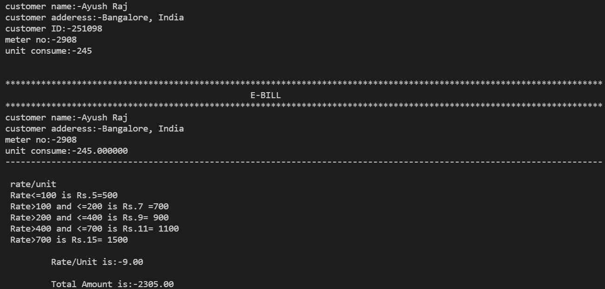

# Electricity Billing Software

The main objective of the Electricity Billing System is to manage the details of Electricity, Bill.

## I have used:

C-Language

## Working
It's simple to use. Firstly enter customer name, customer adderess, customer ID, Meter no. & Unit consume.\
Then, it will automatically generate a E-Bill.

## Screenshot
