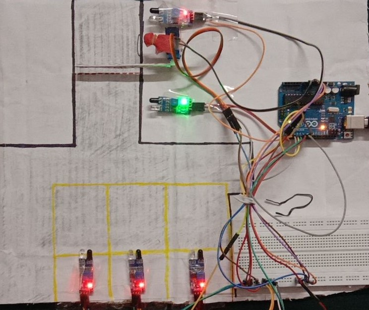

# Automated-Car-Parking-System
___
## 1.0 About Project : 

- This project just needs a power supply through a simple USB to B-type along with an adaptor.
- The system makes use of Arduino Uno Board, Servo Motor and IR sensors. 
- It provides real time working of Automated Car Parking System. 
- As it's name says, "Automated", and hence no need for any human intervention. 
- The project opens the entry gate when a vehicle reaches the gate automatically.
- This project is connected in such a way that it will show a Red light at the entrance if parking is full. 
- It will also not let gates open during entry if parking slot is full.
- Until another vehicle leaves the parking, exit gate will not open. (Because if no car left the parking, then why should the exit gate open? )
- During Exit, the gate opens automatically when vehicle reaches the gate.

## 2.0 Requirements for the Project:

- ### 2.1 Hardware Requirements:
    - Arduino Uno
    - Servo Motor
    - IR sensor
    - Jumper wires - Many (Really a LOT)

- ### 2.2 Software Requirements:
    - Arduino IDE

## 3.0 Snapshot of Project

**_HARDWARE_**

___

### For video of the working project : **_https://drive.google.com/drive/folders/1Db1b76ZQK_kXBs_6UsY6Ce7AiHFA8eKP?usp=sharing_**
___
