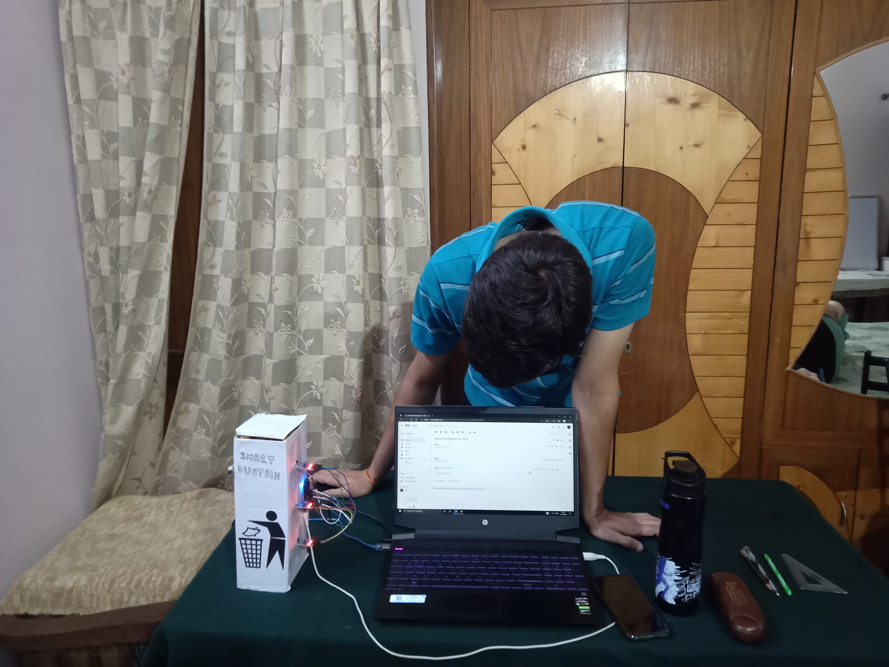

# Smart-Garbage-Monitoring-System
___
## 1.0 About Project : 

- This project just needs a power supply through a simple micro type mobile charger and a Wi-Fi Connection.
- The system makes use of NodeMCU, Servo Motor and IR sensors. 
- It provides Smart City real time working of Garbage Monitoring System. 
- This project is connected to Blynk App through which user is notified about the dustbin being nearly full. 
- The project notifies as a notification and an E-Mail, if dustbin is about to fill. 
- This project has also been connected with Web Application, which will give real - time changes in dustbin.
- You can easily access the website from this link: https://smart-dustbin-296ba.web.app .
- USER: abc@gmail.com
- PASS: 123456
- Psst.. Do not tell anyone these details (SARCASM)

## 2.0 Requirements for the Project:

- ### 2.1 Hardware Requirements:
    - NodeMCU - ESP8266
    - Jumper wires
    - IR Sensors
    - Servo Motor

- ### 2.2 Software Requirements:
    - Arduino IDE
    - Blynk Android app
    - Blue Stacks Blynk App (In case used through PC)
    - Firebase

## 3.0 Some Snapshots of Project

**_HARDWARE_**

___

**_SOFTWARE (BLYNK)_**
___

## Video Presentation
    https://drive.google.com/drive/folders/1QBlyoB27KsUcv8XBuUhNPk_sLzTirhll

___

**_JUST ME CHECKING MY CIRCUIT_**

 
