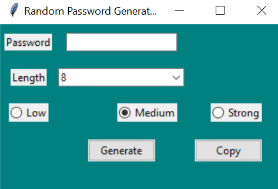
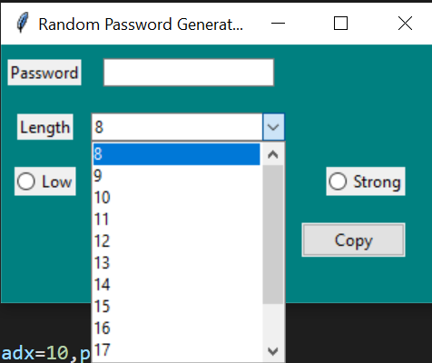

# Random Password Generator

A random password generator is a software program, hardware device, or online tool that automatically generates a password using parameters that a user sets, including mixed-case letters, numbers, symbols, pronounceability, length, and strength.

## Screenshot

## Reference
-> My own\
-> Google [Open](https://www.google.com)

